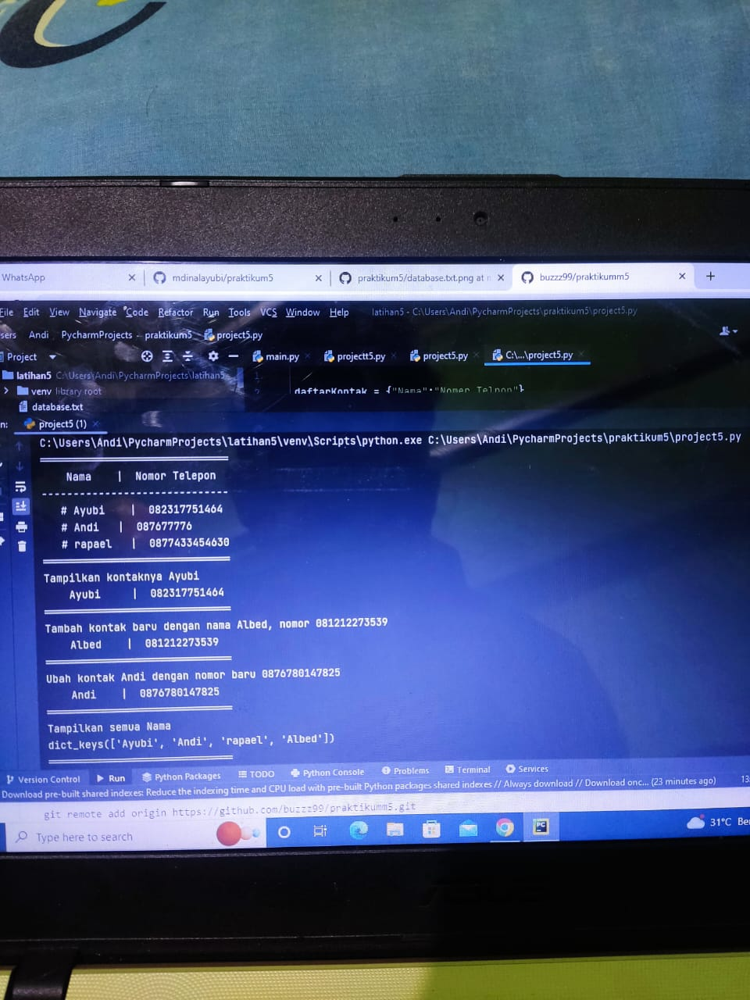
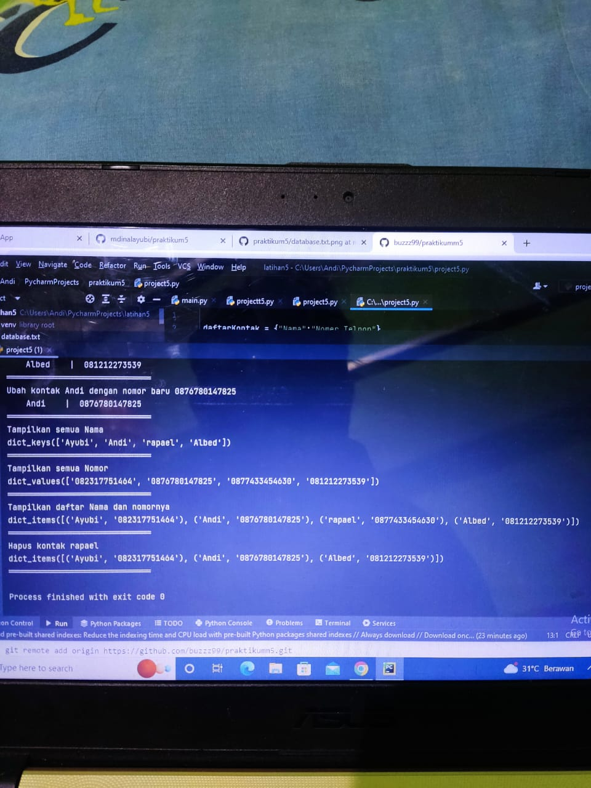

# praktikum5
daftarKontak = {"Nama":"Nomer Telpon"}
kontak       = {'Ayubi':'082317751464', 'Andi' : '087677776', 'rapael' : '0877433454630'}

#print
print(30*"═")
print("    Nama    |  Nomor Telepon  ") #prinr daftarkontak
print(30*"-")
print("   # Ayubi    | ", kontak['Ayubi']) #print kontak Ayubi
print("   # Andi   | ", kontak['Andi']) #print kontak Andi
print("   # rapael   | ", kontak['rapael']) #print kontak Andi
print(30*"═")

#Tampilkan kontaknya Ayubi
print("Tampilkan kontaknya Ayubi")
print("    Ayubi     | ", kontak['Ayubi']) #print kontak Ayubi
print(30*"═")
#Tambah kontak baru dengan nama Albed, nomor 081212273539
print("Tambah kontak baru dengan nama Albed, nomor 081212273539")
kontak['Albed'] = '081212273539'
print("    Albed    | ", kontak['Albed'])
print(30*"═")

#Ubah kontak Andi dengan nomor baru 0876780147825
print("Ubah kontak Andi dengan nomor baru 0876780147825")
kontak['Andi'] = '0876780147825'
print("    Andi    | ", kontak['Andi'])
print(30*"═")

#Tampilkan semua Nama
print("Tampilkan semua Nama")
print(kontak.keys())
print(30*"═")

#Tampilkan semua Nomor
print("Tampilkan semua Nomor")
print(kontak.values())
print(30*"═")

#Tampilkan daftar Nama dan nomornya
print("Tampilkan daftar Nama dan nomornya")
print(kontak.items())
print(30*"═")

#MengHapus kontak Dapit
print("Hapus kontak rapael")
kontak.pop('rapael')
print(kontak.items())
print(30*"═")

# praktikumm5

import os,sys
P = print
Oc = os.system
while True:
    P("")
    P("")
    c = input("L)ihat, T)ambah, U)bah, H)apus, C)ari, K)eluar: ")
    if c.lower() == 'k':
        break
    elif c.lower() == 'l':
        i = open('database.txt','r').read().splitlines()
        P(" ╔═════════════════════════════════════════════════════════════════════╗")
        P(" ╠════════════════════════════ DAFTAR NILAI ══════════════════════════╣")
        P(" ╠══════════════════╦══════════════════╦═══════╦═══════╦═══════╦═══════╣")
        P(" ║      NAMA        ║       NIM        ║ TUGAS ║  UTS  ║  UAS  ║ AKHIR ║")
        P(" ╠══════════════════╬══════════════════╬═══════╬═══════╬═══════╬═══════╣")
        for l in i:
            if l == '':
                pass
            else:
                l1 = l.replace('Nama : ','').replace('Nim : ','').replace('Tugas : ','').replace('UTS : ','').replace('UAS : ','').replace('Akhir : ','')
                na,ni,tu,uts,uas,akhir = l1.strip().split('|')
                P((' ║ ')+(na[:15]).ljust(17,'.')+('║ ')+(ni).ljust(17)+('║ ')+(tu).ljust(6)+('║ ')+(uts).ljust(6)+('║ ')+(uas).ljust(6)+('║ ')+(akhir).ljust(6)+('║'))
        P(" ╚══════════════════╩══════════════════╩═══════╩═══════╩═══════╩═══════╝")
    elif c.lower() == 'C':
        cari = input(' Mencari : ')
        i = open('database.txt','r').read().splitlines()
        P(" ╔═════════════════════════════════════════════════════════════════════╗")
        P(" ╠════════════════════════════ DAFTAR NILAI ══════════════════════════╣")
        P(" ╠══════════════════╦══════════════════╦═══════╦═══════╦═══════╦═══════╣")
        P(" ║      NAMA        ║       NIM        ║ TUGAS ║  UTS  ║  UAS  ║ AKHIR ║")
        P(" ╠══════════════════╬══════════════════╬═══════╬═══════╬═══════╬═══════╣")
        for l in i:
            if l == '':
                pass
            elif cari in l:
                l1 = l.replace('Nama : ','').replace('Nim : ','').replace('Tugas : ','').replace('UTS : ','').replace('UAS : ','').replace('Akhir : ','')
                na,ni,tu,uts,uas,akhir = l1.strip().split('|')
                P((' ║ ')+(na).ljust(17)+('║ ')+(ni).ljust(17)+('║ ')+(tu).ljust(6)+('║ ')+(uts).ljust(6)+('║ ')+(uas).ljust(6)+('║ ')+(akhir).ljust(6)+('║'))
        P(" ╚══════════════════╩══════════════════╩═══════╩═══════╩═══════╩═══════╝")
    elif c.lower() == 'h':
        u = open('database.txt','r').read().splitlines()
        target = input(' Masukan Nama : ')
        nm = []
        for l in u:
            if l == '':
                pass
            else:
                l1 = l.replace('Nama : ','').replace('Nim : ','').replace('Tugas : ','').replace('UTS : ','').replace('UAS : ','').replace('Akhir : ','')
                na,ni,tu,uts,uas,akhir = l1.strip().split('|')
                if str(na) == str(target):
                    P('BERHASIL MENGHAPUS Data %s'%(target))
                    pass
                else:
                    nm.append(str(l)+'\n')
        new = open('database.txt','w')
        new.write(str(nm))
        new.close()
        new = open('database.txt','r').read().splitlines()
        new1 = open('database.txt','w')
        new1.close()
        new2 = open('database.txt','a')
        for i in new:
            i2 = i.replace("['","").replace("\\n', '", "\n").replace("']","").replace("\\n",'')
            new2.write(i2)
        new2.close()
    elif c.lower() == 'u':
        u = open('database.txt','r').read().splitlines()
        target = input(' Masukan Nama : ')
        nm = []
        for l in u:
            if l == '':
                pass
            else:
                l1 = l.replace('Nama : ','').replace('Nim : ','').replace('Tugas : ','').replace('UTS : ','').replace('UAS : ','').replace('Akhir : ','')
                na,ni,tu,uts,uas,akhir = l1.strip().split('|')
                if na == target:
                    P(' Mengedit Data %s'%(target))
                    while (True):
                        nama = input(" Nama : ")
                        if nama == '':
                            P(' Masukan dengan Nama Dengan Benar')
                        else:
                            break
                    while (True):
                        try:
                            nim  = int(input(" NIM  : "))
                            if nim == '':
                                P(' Masukan Nim dengan Angka')
                        except ValueError:
                            P(' Masukan Nim dengan Angka')
                        else:
                            break
                    while (True):
                        try:
                            tugas  = int(input(" TUGAS  : "))
                            if tugas == '':
                                P(' Masukan TUGAS dengan Angka')
                        except ValueError:
                            P(' Masukan TUGAS dengan Angka')
                        else:
                            break
                    while (True):
                        try:
                            uts  = int(input(" UTS  : "))
                            if uts == '':
                                P(' Masukan UTS dengan Angka')
                        except ValueError:
                            P(' Masukan UTS dengan Angka')
                        else:
                            break
                    while (True):
                        try:
                            uas  = int(input(" UAS  : "))
                            if uas == '':
                                P(' Masukan UAS dengan Angka')
                        except ValueError:
                            P(' Masukan UAS dengan Angka')
                        else:
                            break
                    akhir = round((float(tugas) * 0.3)+(float(uts) * 0.35)+(float(uas) * 0.35),2)
                    edit  =('Nama : '+nama+'|Nim : '+str(nim)+'|Tugas : '+str(tugas)+'|UTS : '+str(uts)+'|UAS : '+str(uas)+"|Akhir : "+str(akhir)+'\n')
                    nm.append(edit+'\n')
                else:
                    nm.append(str(l)+'\n')
        new = open('database.txt','w')
        new.write(str(nm))
        new.close()
        new = open('database.txt','r').read().splitlines()
        new1 = open('database.txt','w')
        new1.close()
        new2 = open('database.txt','a')
        for i in new:
            i2 = i.replace("['","").replace("\\n', '", "\n").replace("']","").replace("\\n","\n")
            new2.write(i2+'\n')
        new2.close()
    elif c.lower() == 't':
        i = open('database.txt','a')
        P(" Tambah Kontak")
        while (True):
            nama = input(" Nama : ")
            if nama == '':
                P(' Masukan dengan Nama Dengan Benar')
            else:
                break
        while (True):
            try:
                nim  = int(input(" NIM  : "))
                if nim == '':
                    P(' Masukan Nim dengan Angka')
            except ValueError:
                P(' Masukan Nim dengan Angka')
            else:
                break
        while (True):
            try:
                tugas  = int(input(" TUGAS  : "))
                if tugas == '':
                    P(' Masukan TUGAS dengan Angka')
            except ValueError:
                P(' Masukan TUGAS dengan Angka')
            else:
                break
        while (True):
            try:
                uts  = int(input(" UTS  : "))
                if uts == '':
                    P(' Masukan UTS dengan Angka')
            except ValueError:
                P(' Masukan UTS dengan Angka')
            else:
                break
        while (True):
            try:
                uas  = int(input(" UAS  : "))
                if uas == '':
                    P(' Masukan UAS dengan Angka')
            except ValueError:
                P(' Masukan UAS dengan Angka')
            else:
                break
        akhir = round((float(tugas) * 0.3)+(float(uts) * 0.35)+(float(uas) * 0.35),2)
        i.write('\nNama : '+nama+'|Nim : '+str(nim)+'|Tugas : '+str(tugas)+'|UTS : '+str(uts)+'|UAS : '+str(uas)+"|Akhir : "+str(akhir)+'\n')
        i.close()
        Oc("clear")
    else:
        P("Pilih menu yang tersedia")

! [gambar3](screenshot/hasilpraktikum5.jpeg)